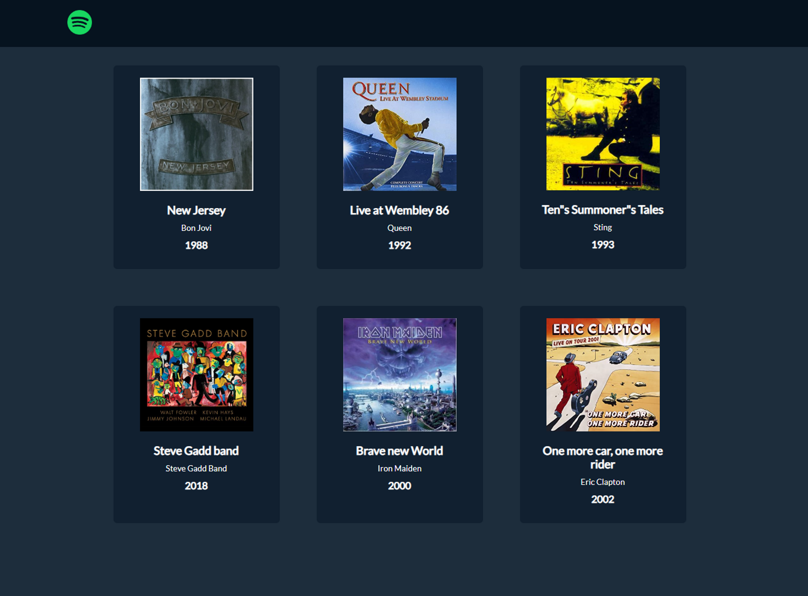

# Esercizio : PHP Dischi JSON

nome repo: **php-dischi-json**

## Descrizione

Dobbiamo creare una web-app che permetta di leggere e stampare in pagina una lista di dischi presente nel nostro server.

## Bonus:

1. Aggiungete ad ogni disco la chiave "like" con valore booleano che rappresenta se l'utente ha aggiunto il disco ai preferiti.
   Al click sul bottone per ogni disco fare una chiamata api che cambia il valore del like nel file json e invia l'array di dischi aggiornati da stampare in pagina.

2. Permettere all'utente di selezionare se visualizzare tutti i dischi o solo quelli preferiti. Il filtro deve essere applicato lato server. Quindi il client invia la richiesta al server con il valore del filtro, il server prepara l'array di dischi in base al filtro e lo invia al client.

### Stack

Html, CSS/Bootstrap, VueJS (importato tramite CDN), axios, PHP

### Consigli

Nello svolgere l’esercizio seguite un approccio graduale.
Prima assicuratevi che la vostra pagina index.php (il vostro front-end) riesca a comunicare correttamente con il vostro script PHP (le vostre “API”).
Solo a questo punto sarà utile passare alla lettura della lista da un file JSON.
